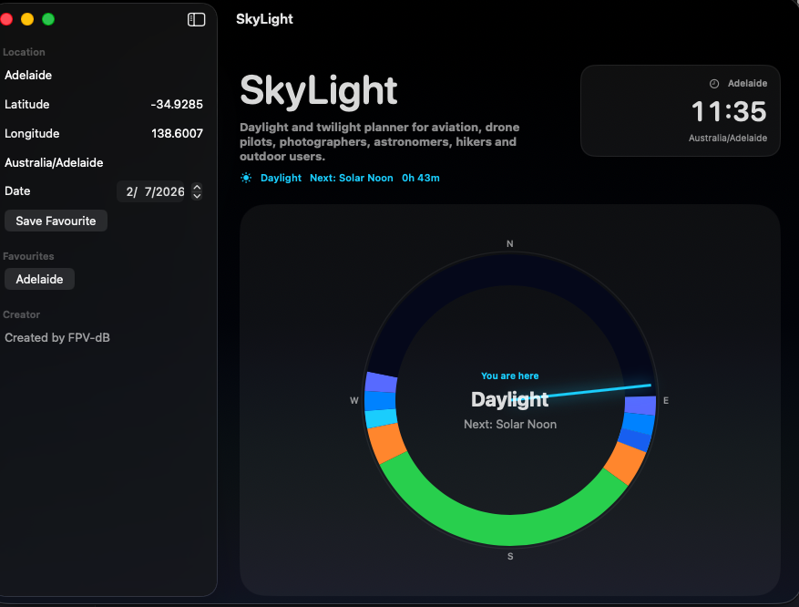
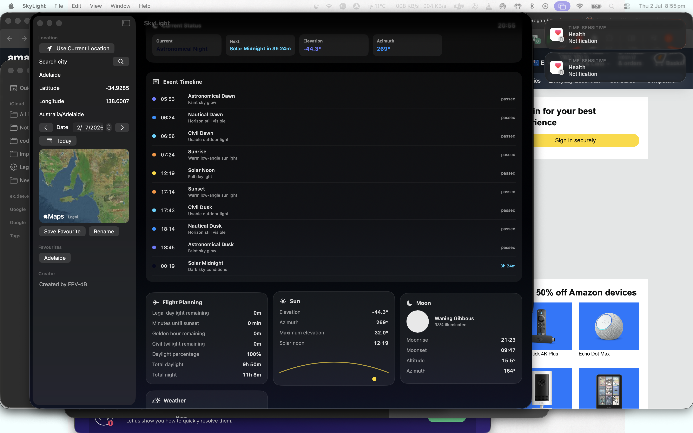

# SkyLight

SkyLight is a native macOS daylight, twilight and astronomy planner for photographic work, drone video production, astronomy, aviation planning, hiking, location scouting and other outdoor users who need to understand exactly when the light will change.

It is built with SwiftUI and runs as a local Mac app. Core daylight, twilight and solar calculations happen on-device, with no cloud backend required for the main planning workflow.





## Highlights

- Circular 24-hour daylight and twilight dial
- Live current-time indicator
- Selected-location clock and timezone display
- Current phase and countdown to the next solar event
- Hover detail cards for dial segments with time range and approximate Kelvin color temperature
- Day simulator slider from 00:00 to 23:59
- Chronological event timeline
- Flight planning metrics for daylight, sunset, golden hour and civil twilight
- Sun elevation and azimuth estimates
- Moon phase and illumination panel
- City search, current-location lookup, manual coordinates and map-based location selection
- Favourite locations
- Dark Apple-style interface with glass panels, subtle gradients and SF Symbols

## Built For

SkyLight is designed for people who care about light and timing:

- Photographers planning sunrise, sunset, golden hour, blue hour and low-light shoots
- Drone video makers timing cinematic light, legal daylight windows and safe return-to-home margins
- GA and recreational pilots checking daylight and twilight context
- Astronomers checking twilight boundaries, dark-sky windows and moon conditions
- Filmmakers and location scouts comparing usable light across dates and locations
- Survey, mapping and inspection crews planning consistent lighting for field captures
- Hikers, campers and outdoor users planning around sunrise, sunset and usable light
- Event, wedding and real-estate shooters scheduling exterior work around the best natural light

## Requirements

- macOS 14 or later
- Xcode with the macOS SDK
- Apple Silicon build target is currently used by the local release command

## Build

From the repository root:

```sh
DEVELOPER_DIR=/Applications/Xcode.app/Contents/Developer \
xcodebuild -project SkyLight.xcodeproj \
  -scheme SkyLight \
  -configuration Release \
  -destination 'platform=macOS,arch=arm64' \
  build
```

The built app will be in Xcode DerivedData under `Build/Products/Release/SkyLight.app`.

## Install Locally

After building, copy the release app to `/Applications`:

```sh
ditto /path/to/DerivedData/Build/Products/Release/SkyLight.app /Applications/SkyLight.app
open /Applications/SkyLight.app
```

## Permissions

SkyLight can use location services when you choose current-location mode. The app includes a location usage string:

> SkyLight uses your location to calculate local sunrise, sunset, and twilight times.

Manual coordinates, city search and map selection can also be used when you do not want to use current location.

## Notes

Weather is shown as an optional panel placeholder. The app is structured so a provider can be added later without affecting the instant local solar calculations.

Moon data is currently an approximate local planning aid. Solar event calculations are intended for planning context and should not replace official aviation, weather, NOTAM, CASA/FAA/local authority or safety sources.

## Project Status

SkyLight is actively evolving toward a premium professional planning tool: precise enough to be useful, calm enough to keep open, and beautiful enough to make daylight planning feel immediate.
