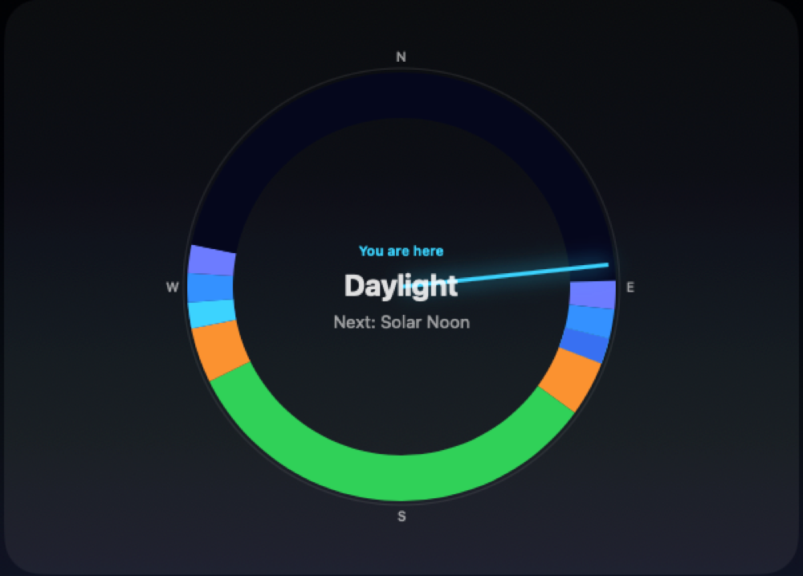
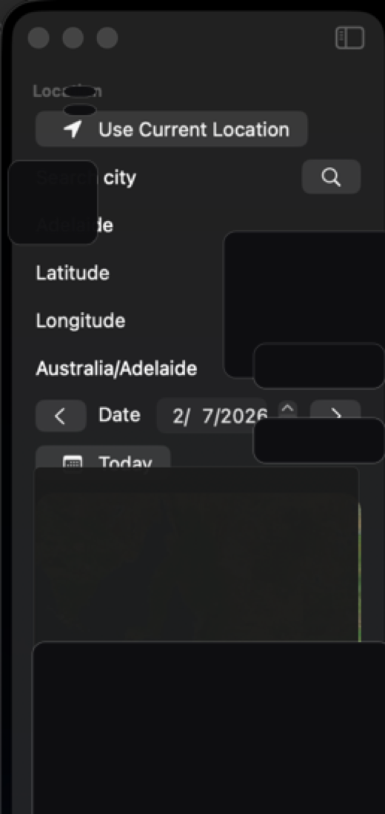
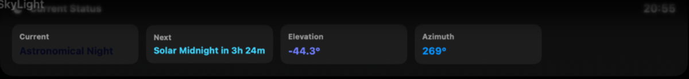
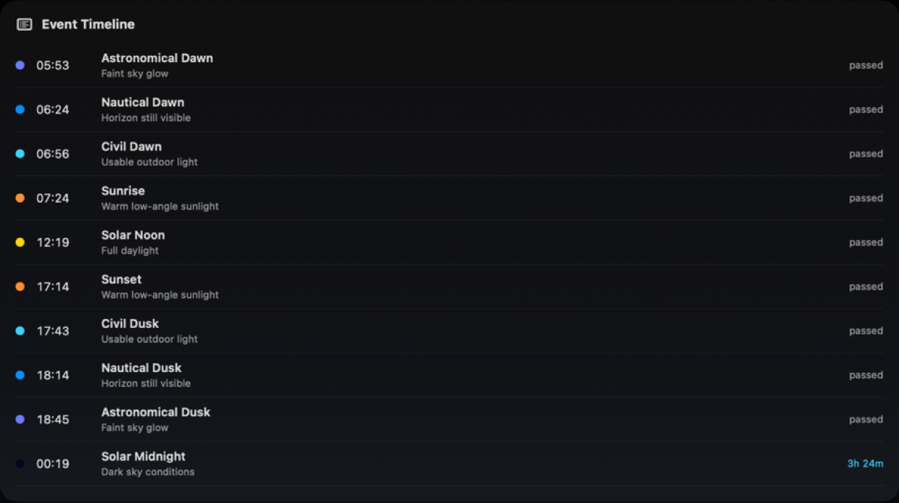
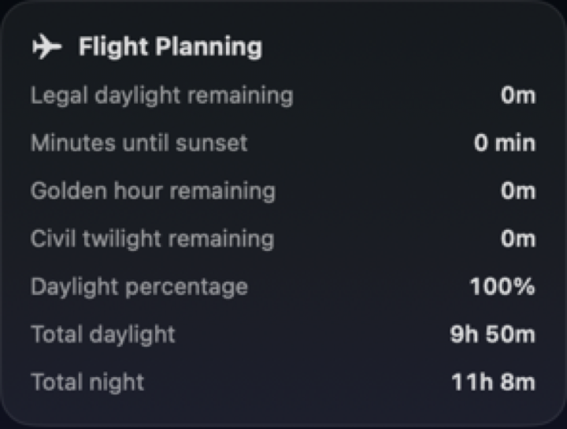
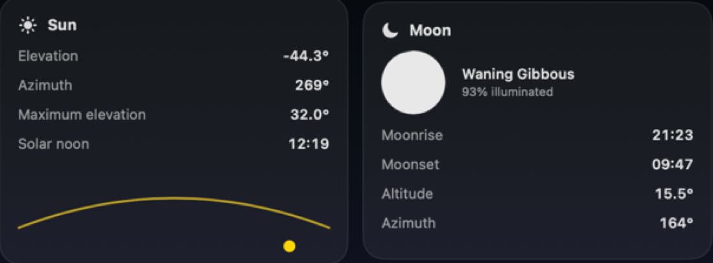

# SkyLight

SkyLight is a native macOS daylight, twilight and astronomy planner for photographic work, drone video production, astronomy, aviation planning, hiking, location scouting and other outdoor users who need to understand exactly when the light will change.

It is built with SwiftUI and runs as a local Mac app. Core daylight, twilight, solar and planning calculations happen on-device, with no cloud backend required for the main workflow.


SkyLight is intended to be a calm planning surface rather than a weather website or a spreadsheet. It gives you the practical daylight information you need at a glance, then lets you drill into the details when timing matters.

## Highlights

- Circular 24-hour daylight and twilight dial
- Live current-time indicator
- Selected-location clock and timezone display
- Current phase and countdown to the next solar event
- Hover detail cards for dial segments with time range and approximate Kelvin color temperature
- Day simulator slider from 00:00 to 23:59
- Chronological event timeline
- Flight planning metrics for daylight, sunset, golden hour and civil twilight
- Sun elevation and azimuth estimates
- Moon phase and illumination panel
- City search, current-location lookup, manual coordinates and map-based location selection
- Favourite locations
- Dark Apple-style interface with glass panels, subtle gradients and SF Symbols

## Why It Exists

Light changes quickly, and the useful answer is rarely just "sunrise" or "sunset". A drone video maker may need legal daylight plus a safety margin. A photographer may care more about the exact golden hour or blue hour window. An astronomer needs to know when astronomical twilight ends. A hiker needs to know when usable light runs out on the return leg.

SkyLight brings those overlapping needs into one Mac utility:

- Plan shoots around golden hour, blue hour, sunrise, sunset and low-angle light
- Check twilight boundaries for astronomy, stargazing and dark-sky sessions
- Estimate legal and practical daylight remaining for drone and aviation workflows
- Compare locations and dates before travelling to a shoot, trail, airfield or survey site
- Use a scrubber to preview how the day changes minute by minute
- Keep favourite locations available without retyping coordinates

## Built For

SkyLight is designed for people who care about light and timing:

- Photographers planning sunrise, sunset, golden hour, blue hour and low-light shoots
- Drone video makers timing cinematic light, legal daylight windows and safe return-to-home margins
- GA and recreational pilots checking daylight and twilight context
- Astronomers checking twilight boundaries, dark-sky windows and moon conditions
- Filmmakers and location scouts comparing usable light across dates and locations
- Survey, mapping and inspection crews planning consistent lighting for field captures
- Hikers, campers and outdoor users planning around sunrise, sunset and usable light
- Event, wedding and real-estate shooters scheduling exterior work around the best natural light

## Screenshots

### Full Planning Window


The main planner combines current status, the chronological event list, flight-planning figures, sun data, moon data and optional weather space into one dark macOS window. The layout is designed for scanning: the urgent information stays near the top, while the detailed planning panels sit below.

### Circular Daylight Dial



The circular dial represents the full 24-hour day. Colour-coded segments separate daylight, golden hour, blue hour, civil twilight, nautical twilight, astronomical twilight and night. The live indicator points to the current time, and each segment can expose timing and colour-temperature context.

### Location And Date Controls



The sidebar supports current location, city search, manual coordinates, map selection, date navigation and saved favourites. Timezone handling is part of the location workflow, so the displayed clock and event times stay tied to the selected place rather than the computer's current system timezone.

### Current Status



The current-status cards show the active phase, next event, countdown, solar elevation and solar azimuth. This is the quick answer panel: useful when you need to know whether you are in daylight, twilight, astronomical night, or approaching a time-sensitive transition.

### Event Timeline



The timeline lists the day's astronomical events in chronological order, including astronomical dawn, nautical dawn, civil dawn, sunrise, solar noon, sunset, twilight phases and solar midnight. Each row includes a time, a colour cue and status text, making it easier to plan around upcoming light changes.

### Flight Planning



The flight-planning panel summarises operational daylight: legal daylight remaining, minutes until sunset, golden hour remaining, civil twilight remaining, daylight percentage, total daylight and total night length. It is aimed at drone operators, pilots and outdoor crews who need a fast operational readout.

### Sun And Moon Panels



The sun panel tracks elevation, azimuth, maximum elevation and solar noon, with a compact sun-path graphic. The moon panel shows phase, illumination, moonrise, moonset, altitude and azimuth for night photography, astronomy planning and low-light field work.

## Feature Details

### Daylight And Twilight Planning

SkyLight separates the day into practical phases rather than treating daylight as a single block. The dial and timeline distinguish daylight, golden hour, blue hour, civil twilight, nautical twilight, astronomical twilight and astronomical night. That helps different users make different decisions from the same solar model.

### Scrubbable Day Simulator

The day slider lets you move through 00:00 to 23:59 and watch the selected phase, sun position and planning context update. It is useful for comparing how quickly conditions change near sunrise and sunset, or for previewing a future date before committing to a shoot or flight window.

### Location Workflow

SkyLight supports several location entry styles because planning rarely happens in only one place. You can use the Mac's current location, search for a city, enter coordinates manually, click on the map, or save favourite places for repeat use.

### Privacy

The screenshots in this repository have location coordinates and map details obscured. The app itself performs the main daylight calculations locally, and manual location entry remains available if you do not want to use macOS Location Services.

## Requirements

- macOS 14 or later
- Xcode with the macOS SDK
- Apple Silicon build target is currently used by the local release command

## Build

From the repository root:

```sh
DEVELOPER_DIR=/Applications/Xcode.app/Contents/Developer \
xcodebuild -project SkyLight.xcodeproj \
  -scheme SkyLight \
  -configuration Release \
  -destination 'platform=macOS,arch=arm64' \
  build
```

The built app will be in Xcode DerivedData under `Build/Products/Release/SkyLight.app`.

## Install Locally

After building, copy the release app to `/Applications`:

```sh
ditto /path/to/DerivedData/Build/Products/Release/SkyLight.app /Applications/SkyLight.app
open /Applications/SkyLight.app
```

## Permissions

SkyLight can use location services when you choose current-location mode. The app includes a location usage string:

> SkyLight uses your location to calculate local sunrise, sunset, and twilight times.

Manual coordinates, city search and map selection can also be used when you do not want to use current location.

## Notes

Weather is shown as an optional panel placeholder. The app is structured so a provider can be added later without affecting the instant local solar calculations.

Moon data is currently an approximate local planning aid. Solar event calculations are intended for planning context and should not replace official aviation, weather, NOTAM, CASA/FAA/local authority or safety sources.

## Project Status

SkyLight is actively evolving toward a premium professional planning tool: precise enough to be useful, calm enough to keep open, and beautiful enough to make daylight planning feel immediate.
